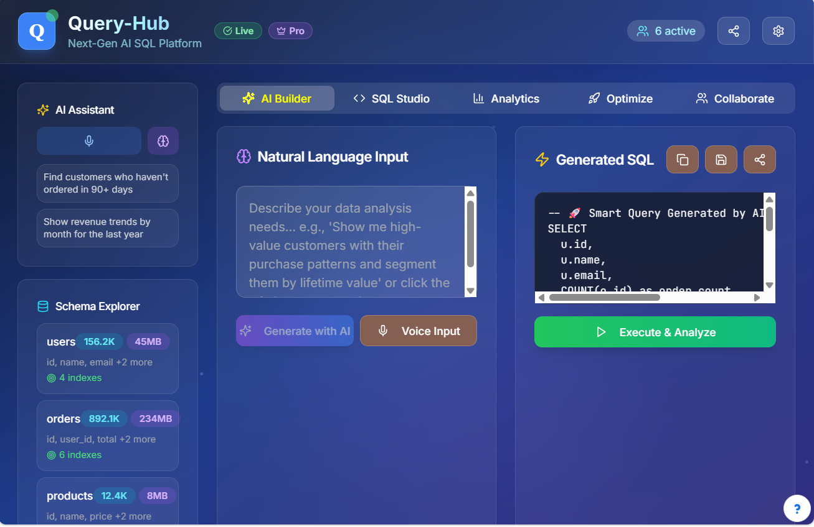

# 🚀 QueryHub: Real-Time SQL Query Generator 🔥

Welcome to **QueryHub**!  
Your one-stop solution for generating powerful SQL queries in real time for any kind of database.  
Transform your workflow and supercharge your productivity with QueryHub! ✨

# Live Test SS- 

## 🌟 Features

- ⚡ **Instant Query Generation:** Create complex SQL queries on the fly—no manual coding needed!
- 🎯 **Database Agnostic:** Works seamlessly with all major databases.
- 🧠 **Smart Suggestions:** Intelligent recommendations to optimize your queries.
- 🛡️ **Secure & Reliable:** Built with best practices in TypeScript and CSS for robust performance.
- 🛠️ **Customizable:** Tweak and tailor to fit your unique needs.

## 📦 Tech Stack

- **TypeScript** (93.9%)
- **CSS** (6%)
- **Other** (0.1%)

## 🚀 Getting Started

1. **Clone the repo**  
   ```bash
   git clone https://github.com/RudraCodesForU/QueryHub.git
   
2. **Install dependencies**
```bash
npm install
npm run dev

## Running at :
😍 || https://localhost:8080
